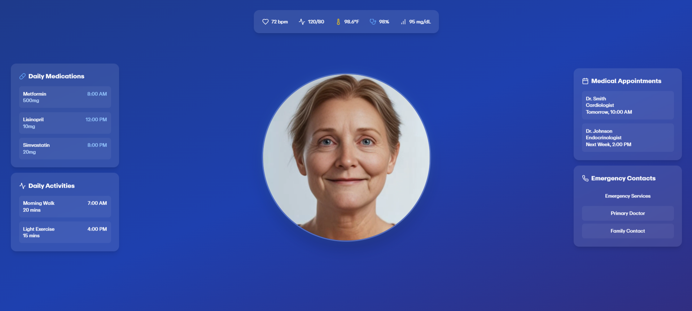

# HealthCompanion: AI-Powered Elderly Care Assistant



## Project Overview
Inspired by a personal loss and the challenges of providing constant care for elderly loved ones, HealthCompanion transforms elderly care through intelligent monitoring and companionship. This project was born from my experience with my grandmother, where the need for round-the-clock attention highlighted the gap in elderly care solutions.

## Demo Video
[](https://youtu.be/ShlU03shi40)

## Technical Implementation
* **Simli AI** - Creating a lifelike, empathetic visual avatar
* **Vapi** - Natural voice interactions and health knowledge processing
* **Unified** - Storing and managing medical documentation
* **Tech Stack** - Next.js, React, and Tailwind CSS for a modern, responsive interface

## Key Features
* 24/7 virtual health companion with real-time vitals monitoring
* Medication scheduling and reminders
* Emergency contact system
* Daily activity tracking
* Medical appointment management
* Natural conversation with contextual health awareness

## What Makes It Special

### 1. Personalized Care
The system maintains a comprehensive knowledge of each patient's medical history, medications, and preferences

### 2. Proactive Monitoring
Alerts caregivers about concerning changes in vital signs or missed medications

### 3. Companionship
Reduces loneliness while maintaining health oversight

### 4. Peace of Mind
Allows family members to monitor their loved ones remotely while ensuring immediate response to emergencies

## Impact
This isn't just another health monitoring system – it's a compassionate companion that helps preserve both the independence of elderly individuals and the peace of mind of their families. By combining cutting-edge AI technology with practical healthcare needs, we're addressing a critical gap in elderly care that affects millions of families worldwide.

## Get Started
```bash
npm install
npm run dev
```

## License
MIT

